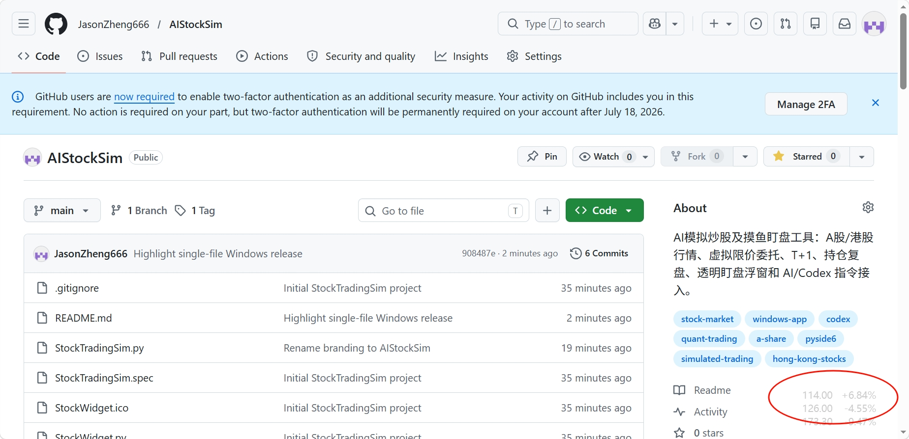

# AIStockSim

Windows 上的 A 股、港股模拟交易与透明盯盘工具。当前版本 **3.3.0**，是 3.X 系列的收尾版本。无需注册量化平台账户；AI 分析可选，本地行情、缠论信号和回测可以独立使用。

## 下载与运行

在 [Releases](https://github.com/JasonZheng888/AIStockSim/releases) 下载 `StockTradingSim.exe`，直接运行。账户和设置保存在 `%APPDATA%\StockTradingSim`；升级时保留该目录即可。

源码运行与 Windows 打包：

```powershell
python -m venv .venv
.\.venv\Scripts\python.exe -m pip install -r requirements-build.txt
.\.venv\Scripts\python.exe StockTradingSim.py
.\.venv\Scripts\python.exe -m unittest discover -s tests -v
.\build_windows.ps1
```

打包输出为 `dist\StockTradingSim.exe`。脚本使用独立的临时目录与 DLL 搜索路径，避免其他工具的 ICU 库干扰 Qt。

## 盯盘模式

主窗口点击“盯盘模式”进入透明浮窗，支持置顶、拖动、自选指标、颜色、字体、K 线以及右键设置。可随时返回主窗口；两个视图共用自选股和行情。盯盘是本项目持续保留的核心功能。

主窗口固定浅色主题，兼容 Windows 深色设置；记住上次大小、位置、最大化和全屏状态。全局设置支持滚动和屏幕边界保护。



## 本地策略与模拟交易

- 默认启用缠论结构策略，旧 CAN SLIM 等参考项默认关闭。CAN SLIM 属于欧奈尔成长股体系，与缠论分别配置。
- 对已收盘日 K 顺序处理包含、分型和严格笔，记录中枢生命周期、买卖点确认时刻及结构依据。可选择三买、二三买、一二三买模式。
- 背驰必须有可比结构及力度证据；不把两根 MACD 柱缩短直接视为买点。当前交易信号仍明确标为笔级实验代理，未宣称完整递归缠论。模型范围见 [缠论模型说明](docs/chan-model.md)。
- 每只股票可以设置每笔买入的固定股数，默认使用最低申报数量；余额不足会说明原因，不会偷偷缩量。已有持仓可以继续买入，手动允许重新提交候选；自动提交按确认事件去重，避免行情刷新反复派单。
- 同股活动委托最多 **3** 笔。委托持续有效，直到成交或撤销；结构止损属于持仓退出逻辑，不是禁止入场的门槛。
- ST 可以买入。资金冻结、有效价格、股票申报数量、交易时段、报价时效、A 股 T+1 可卖量等基础执行规则继续校验。
- 移除人为仓位比例、风险预算、追涨幅度、亏损后禁止加买、市场红灯禁买、尾盘禁买等额外拦截；策略观察与下单校验分别展示。
- 本地自动提交默认关闭；AI 自动执行、手动下单与本地策略各自保留独立设置。

行情刷新会补齐历史日 K，缓存可以在下次启动复用。A 股、港股限价委托、持仓成本、交易记录、账户曲线、AI 报告与本地 JSON 文件桥均保留。

## 回测

“策略”页可以使用已缓存日 K 在后台回测；回测不改变模拟账户。实时候选和回测使用同一缠论函数，逐个历史时点确认信号，最早在下一根 K 线成交。支持多批持仓、持续委托，分别记录信号、订单、等待原因和成交。

研究脚本：

```powershell
.\.venv\Scripts\python.exe scripts\fetch_backtest_data.py --as-of 2026-10-03
.\.venv\Scripts\python.exe scripts\run_strategy_backtest.py
```

研究数据与生成的报告保存在本地，不作为软件源码的一部分。前复权日线、统一成本假设与简化成交模型适合比较策略；没有重建历史停牌、涨跌停队列、公司行动和实际汇率，不能当作真实成交收益。主模拟账户当前仍使用原有费用与资金池口径，回测成本单独披露。

## AI 与本地文件桥

AI 工作台支持 OpenAI-compatible 接口、角色分析、候选指令预审与对话。没有 API 配置时，本地功能仍可使用。AI 提出的买卖与普通下单走相同校验。

运行目录下的 AI 报告以及下列文件可能包含个人配置、账户和交易信息，不能上传到公开仓库：

```text
%APPDATA%\StockTradingSim\portfolio.json
%APPDATA%\StockTradingSim\codex_orders.json
%APPDATA%\StockTradingSim\codex_snapshot.json
%APPDATA%\StockTradingSim\codex_result.json
%APPDATA%\StockTradingSim\codex_kline_history.json
```

文件桥支持 `buy`、`sell`、`hold`、`cancel` 和 `amend`。买卖必须提供 `limit_price`；撤单、改单推荐使用 `order_id` 精确指定。

```json
[
  {"action": "buy", "code": "sh600000", "qty": 100, "limit_price": 12.5, "reason": "本地模拟委托"},
  {"action": "cancel", "order_id": "指定的委托ID", "reason": "撤销未成交委托"}
]
```

本项目只做模拟交易，不连接真实证券账户。未知港股的每手数量应在设置中核实；A 股与港股目前共用模拟资金池。

## 致谢

透明盯盘浮窗基于 [sbr0574/StockWidget](https://github.com/sbr0574/StockWidget) 扩展。缠论实现参考《教你炒股票》的结构定义，并通过历史前缀测试验证确认时序；没有直接采用 CZSC 的持仓状态限制。
